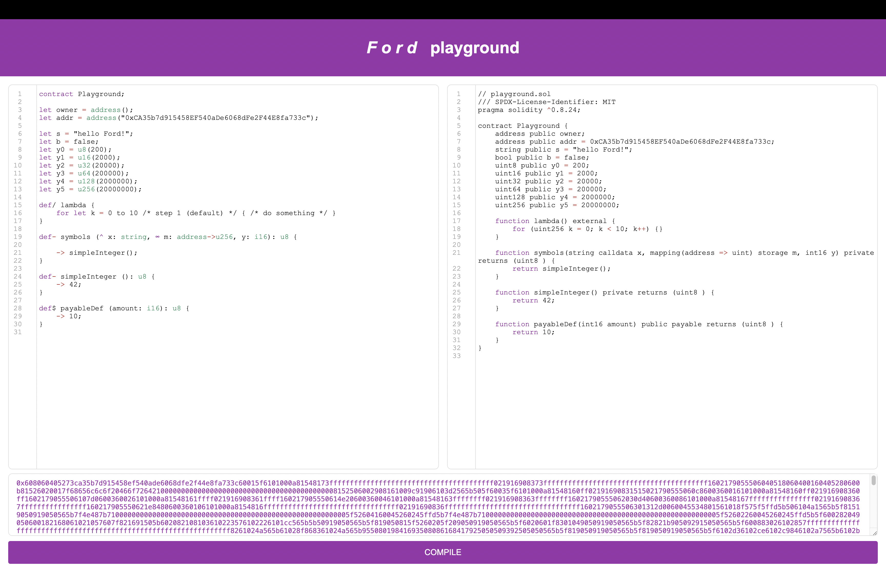

Hello! 🌞



## Ford types

### Signed and unsigned integers
```ford
'i8', 'i16', 'i24', 'i32', 'i40', 'i48', 'i56', 'i64',
'i72', 'i80', 'i88', 'i96', 'i104', 'i112', 'i120', 'i128',
'i136', 'i144', 'i152', 'i160', 'i168', 'i176', 'i184', 'i192',
'i200', 'i208', 'i216', 'i224', 'i232', 'i240', 'i248', 'i256'
```
```ford
'u8', 'u16', 'u24', 'u32', 'u40', 'u48', 'u56', 'u64',
'u72', 'u80', 'u88', 'u96', 'u104', 'u112', 'u120', 'u128',
'u136', 'u144', 'u152', 'u160', 'u168', 'u176', 'u184', 'u192',
'u200', 'u208', 'u216', 'u224', 'u232', 'u240', 'u248', 'u256'
```
Example
```ford
let y0    : u8        = 200;
let y1    : u16       = 2000;
let x0    : i8        = -10;
```

### Strings
```ford
let s   : string    = "hello Ford!";
```

### Addresses
```ford
let addr  : address   = "0xCA35b7d915458EF540aDe6068dFe2F44E8fa733c";
```

### Booleans
```ford
let b     : bool      = false;
```

### Lists
```ford
let li    : list[i32];
```

### Hashmaps
```ford
let mm    : address->u256; 
```


## Command line transpilation 

You start with (playground.ford): 

```ford
contract Playground;

let- s    : string    = "hello Ford!";
let owner : address;
let addr  : address   = "0xCA35b7d915458EF540aDe6068dFe2F44E8fa733c";
let b     : bool      = false;
let y0    : u8        = 200;
let y1    : u16       = 2000;
let x0    : i8        = -10;

let mm    : address->u256; 
let li    : list[i32];

// Public
def somePublicDef {}

// External
def/ lambda {
    for let k = 0 to 10 {}
}

// Private
def- symbols (^ x: string, ∞ m: address->u256, y: i16): u8 {
    return 1;
}

// Payable
def$ payableDef (amount: i16) {
    return 10;
}
```

You do
```shell
npm run compile
```

You end up with (notice that return statements are not transpiled yet...) 

```solidity
// playground.sol
/// SPDX-License-Identifier: MIT
pragma solidity ^0.8.24;

contract Playground {
    string private s = "hello Ford!";
    address public owner;
    address public addr = 0xCA35b7d915458EF540aDe6068dFe2F44E8fa733c;
    bool public b = false;


    uint8 public y0 = 200;
    uint16 public y1 = 2000;
    int8 public x0 = -10;

    mapping(address => uint256) public mm;
    int32[] public li;

    function somePublicDef() public {}

    function lambda() external {
        for (uint256 k = 0; k < 10; k++) {}
    }

    function symbols(string calldata x, mapping(address => uint) storage m, int16 y) private returns (uint8 ) {}

    function payableDef(int16 amount) public payable {}
}
```

### ABI
```shell
[{"inputs":[],"name":"addr","outputs":[{"internalType":"address","name":"","type":"address"}],"stateMutability":"view","type":"function"},{"inputs":[],"name":"b","outputs":[{"internalType":"bool","name":"","type":"bool"}],"stateMutability":"view","type":"function"},{"inputs":[],"name":"lambda","outputs":[],"stateMutability":"nonpayable","type":"function"},{"inputs":[],"name":"owner","outputs":[{"internalType":"address","name":"","type":"address"}],"stateMutability":"view","type":"function"},{"inputs":[{"internalType":"int16","name":"amount","type":"int16"}],"name":"payableDef","outputs":[],"stateMutability":"payable","type":"function"},{"inputs":[],"name":"s","outputs":[{"internalType":"string","name":"","type":"string"}],"stateMutability":"view","type":"function"},{"inputs":[],"name":"somePublicDef","outputs":[],"stateMutability":"nonpayable","type":"function"},{"inputs":[],"name":"x0","outputs":[{"internalType":"int8","name":"","type":"int8"}],"stateMutability":"view","type":"function"},{"inputs":[],"name":"x1","outputs":[{"internalType":"int16","name":"","type":"int16"}],"stateMutability":"view","type":"function"},{"inputs":[],"name":"x2","outputs":[{"internalType":"int32","name":"","type":"int32"}],"stateMutability":"view","type":"function"},{"inputs":[],"name":"x3","outputs":[{"internalType":"int8","name":"","type":"int8"}],"stateMutability":"view","type":"function"},{"inputs":[],"name":"x4","outputs":[{"internalType":"int64","name":"","type":"int64"}],"stateMutability":"view","type":"function"},{"inputs":[],"name":"y0","outputs":[{"internalType":"uint8","name":"","type":"uint8"}],"stateMutability":"view","type":"function"},{"inputs":[],"name":"y1","outputs":[{"internalType":"uint16","name":"","type":"uint16"}],"stateMutability":"view","type":"function"},{"inputs":[],"name":"y2","outputs":[{"internalType":"uint32","name":"","type":"uint32"}],"stateMutability":"view","type":"function"},{"inputs":[],"name":"y3","outputs":[{"internalType":"uint64","name":"","type":"uint64"}],"stateMutability":"view","type":"function"},{"inputs":[],"name":"y4","outputs":[{"internalType":"uint128","name":"","type":"uint128"}],"stateMutability":"view","type":"function"},{"inputs":[],"name":"y5","outputs":[{"internalType":"uint256","name":"","type":"uint256"}],"stateMutability":"view","type":"function"}]
```

### Bytecode
```shell
608060405273ca35b7d915458ef540ade6068dfe2f44e8fa733c60015f6101000a81548173ffffffffffffffffffffffffffffffffffffffff021916908373ffffffffffffffffffffffffffffffffffffffff1602179055506040518060400160405280600b81526020017f68656c6c6f20466f7264210000000000000000000000000000000000000000008152506002908161009c91906104bc565b505f60035f6101000a81548160ff02191690831515021790555060c8600360016101000a81548160ff021916908360ff1602179055506107d0600360026101000a81548161ffff021916908361ffff160217905550614e20600360046101000a81548163ffffffff021916908363ffffffff16021790555062030d40600360086101000a81548167ffffffffffffffff021916908367ffffffffffffffff160217905550621e8480600360106101000a8154816fffffffffffffffffffffffffffffffff02191690836fffffffffffffffffffffffffffffffff1602179055506301312d00600455600a60055f6101000a8154
```

## server-side transpilation

```shell
npm run serve
```
=> 
```shell
Ford transpiler server running on port 3000
```

Then send a POST request to the `/transpile` API endpoint

```shell
curl -X POST \
  http://localhost:3000/transpile \
  -H "Content-Type: application/json" \
  -d "{\"code\": $(cat playground.ford | jq -Rs .)}"
```

That's it!
