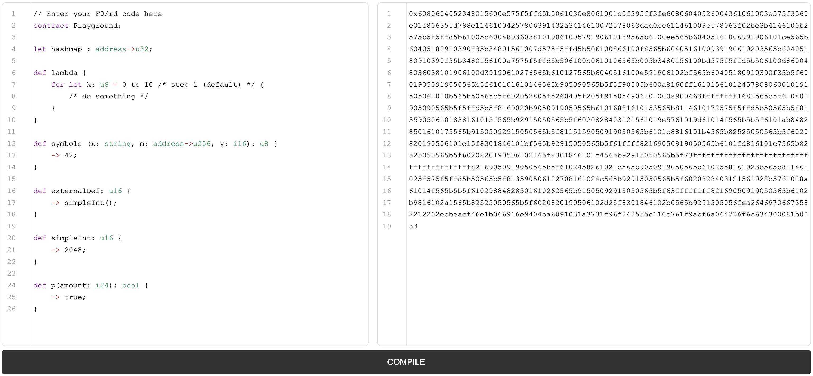

# The F0/rd Smart Contract Programming Language 




## F0/rd types

### Signed and unsigned integers
```F0/rd
'i8', 'i16', 'i24', 'i32', 'i40', 'i48', 'i56', 'i64',
'i72', 'i80', 'i88', 'i96', 'i104', 'i112', 'i120', 'i128',
'i136', 'i144', 'i152', 'i160', 'i168', 'i176', 'i184', 'i192',
'i200', 'i208', 'i216', 'i224', 'i232', 'i240', 'i248', 'i256'
```
```F0/rd
'u8', 'u16', 'u24', 'u32', 'u40', 'u48', 'u56', 'u64',
'u72', 'u80', 'u88', 'u96', 'u104', 'u112', 'u120', 'u128',
'u136', 'u144', 'u152', 'u160', 'u168', 'u176', 'u184', 'u192',
'u200', 'u208', 'u216', 'u224', 'u232', 'u240', 'u248', 'u256'
```
Example
```F0/rd
let y0    : u8        = 200;
let y1    : u16       = 2000;
let x0    : i8        = -10;
```

### Strings
```F0/rd
let s   : string    = "hello F0/rd!";
```

### Addresses
```F0/rd
let addr  : address   = "0xCA35b7d915458EF540aDe6068dFe2F44E8fa733c";
```

### Booleans
```F0/rd
let b     : bool      = false;
```

### Lists
```F0/rd
let li    : list[i32];
```

### Hashmaps
```F0/rd
let mm    : address->u256; 
```


## Command line transpilation 

You start with (playground.f0): 

```ford
// Enter your F0/rd code here
contract Playground;

let hashmap : address->u32;

def lambda {
    for let k: u8 = 0 to 10 /* step 1 (default) */ {
        /* do something */
    }
}

/**
 * ^ x: parameter located in calldata
 * ∞ m: parameter located in storage
 * y: parameter located in memory (default)
 */
def- symbols (^ x: string, ∞ m: address->u256, y: i16): u8 {
    -> 42;
}

def/ externalDef: u16 {
    -> simpleInt();
}

def- simpleInt: u16 {
    -> 2048;
}

def$ p(amount: i24): bool {
    -> true;
}
```

You do
```shell
npm run compile
```

You end up with 

```solidity
// playground.sol
/// SPDX-License-Identifier: MIT
pragma solidity ^0.8.24;

contract Playground {
    mapping(address => uint32) public hashmap;
    
    function lambda() public {
        for (uint8 k = 0; k < 10; k++) {}
    }
    
    function symbols(string calldata x, mapping(address => uint256) storage m, int16 y) private returns (uint8  res) {
        return 42;
    }
    
    function externalDef() external returns (uint16  res) {
        return simpleInt();
    }
    
    function simpleInt() private returns (uint16  res) {
        return 2048;
    }
    
    function p(int24 amount) public payable returns (bool  res) {
        return true;
    }
}
```

### ABI
```shell
[{"inputs":[],"name":"addr","outputs":[{"internalType":"address","name":"","type":"address"}],"stateMutability":"view","type":"function"},{"inputs":[],"name":"b","outputs":[{"internalType":"bool","name":"","type":"bool"}],"stateMutability":"view","type":"function"},{"inputs":[],"name":"lambda","outputs":[],"stateMutability":"nonpayable","type":"function"},{"inputs":[],"name":"owner","outputs":[{"internalType":"address","name":"","type":"address"}],"stateMutability":"view","type":"function"},{"inputs":[{"internalType":"int16","name":"amount","type":"int16"}],"name":"payableDef","outputs":[],"stateMutability":"payable","type":"function"},{"inputs":[],"name":"s","outputs":[{"internalType":"string","name":"","type":"string"}],"stateMutability":"view","type":"function"},{"inputs":[],"name":"somePublicDef","outputs":[],"stateMutability":"nonpayable","type":"function"},{"inputs":[],"name":"x0","outputs":[{"internalType":"int8","name":"","type":"int8"}],"stateMutability":"view","type":"function"},{"inputs":[],"name":"x1","outputs":[{"internalType":"int16","name":"","type":"int16"}],"stateMutability":"view","type":"function"},{"inputs":[],"name":"x2","outputs":[{"internalType":"int32","name":"","type":"int32"}],"stateMutability":"view","type":"function"},{"inputs":[],"name":"x3","outputs":[{"internalType":"int8","name":"","type":"int8"}],"stateMutability":"view","type":"function"},{"inputs":[],"name":"x4","outputs":[{"internalType":"int64","name":"","type":"int64"}],"stateMutability":"view","type":"function"},{"inputs":[],"name":"y0","outputs":[{"internalType":"uint8","name":"","type":"uint8"}],"stateMutability":"view","type":"function"},{"inputs":[],"name":"y1","outputs":[{"internalType":"uint16","name":"","type":"uint16"}],"stateMutability":"view","type":"function"},{"inputs":[],"name":"y2","outputs":[{"internalType":"uint32","name":"","type":"uint32"}],"stateMutability":"view","type":"function"},{"inputs":[],"name":"y3","outputs":[{"internalType":"uint64","name":"","type":"uint64"}],"stateMutability":"view","type":"function"},{"inputs":[],"name":"y4","outputs":[{"internalType":"uint128","name":"","type":"uint128"}],"stateMutability":"view","type":"function"},{"inputs":[],"name":"y5","outputs":[{"internalType":"uint256","name":"","type":"uint256"}],"stateMutability":"view","type":"function"}]
```

### Bytecode
```shell
0x6080604052348015600e575f5ffd5b5061030e8061001c5f395ff3fe60806040526004361061003e575f3560
e01c806355d788e11461004257806391432a3414610072578063dad0be611461009c578063f02be3b4146100b2
575b5f5ffd5b61005c60048036038101906100579190610189565b6100ee565b60405161006991906101ce565b
60405180910390f35b34801561007d575f5ffd5b506100866100f8565b6040516100939190610203565b604051
80910390f35b3480156100a7575f5ffd5b506100b0610106565b005b3480156100bd575f5ffd5b506100d86004
8036038101906100d39190610276565b610127565b6040516100e591906102bf565b60405180910390f35b5f60
019050919050565b5f610101610146565b905090565b5f5f90505b600a8160ff16101561012457808060010191
505061010b565b50565b5f602052805f5260405f205f915054906101000a900463ffffffff1681565b5f610800
905090565b5f5ffd5b5f8160020b9050919050565b61016881610153565b8114610172575f5ffd5b50565b5f81
3590506101838161015f565b92915050565b5f6020828403121561019e5761019d61014f565b5b5f6101ab8482
8501610175565b91505092915050565b5f8115159050919050565b6101c8816101b4565b82525050565b5f6020
820190506101e15f8301846101bf565b92915050565b5f61ffff82169050919050565b6101fd816101e7565b82
525050565b5f6020820190506102165f8301846101f4565b92915050565b5f73ffffffffffffffffffffffffff
ffffffffffffff82169050919050565b5f6102458261021c565b9050919050565b6102558161023b565b811461
025f575f5ffd5b50565b5f813590506102708161024c565b92915050565b5f6020828403121561028b5761028a
61014f565b5b5f61029884828501610262565b91505092915050565b5f63ffffffff82169050919050565b6102
b9816102a1565b82525050565b5f6020820190506102d25f8301846102b0565b9291505056fea2646970667358
2212202ecbeacf46e1b066916e9404ba6091031a3731f96f243555c110c761f9abf6a064736f6c634300081b00
33
```

## server-side transpilation

```shell
npm run serve
```
=> 
```shell
F0/rd transpiler server running on port 3000
```

Then send a POST request to the `/transpile` API endpoint

```shell
curl -X POST \
  http://localhost:3000/transpile \
  -H "Content-Type: application/json" \
  -d "{\"code\": $(cat playground.f0 | jq -Rs .)}"
```

