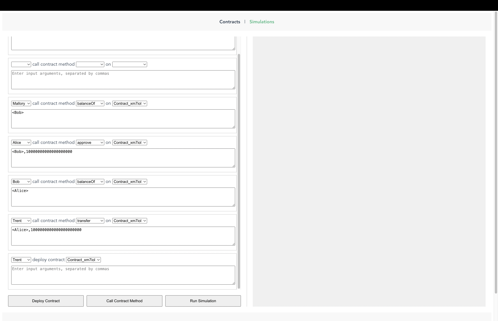

# F0/rd SIMULΞ: Revolutionizing Smart Contract Development

Welcome to F0/rd SIMULΞ, the ultimate tool designed to transform the way you develop smart contracts with F0/rd. Our mission is to make smart contract programming not only powerful but also enjoyable and accessible for everyone.

Introducing SIMULΞ – a groundbreaking tool that empowers developers to deploy, interact with, and test their F0/rd smart contracts effortlessly. Whether you're a seasoned developer or just starting out, F0/rd SIMULΞ is here to streamline your workflow.

